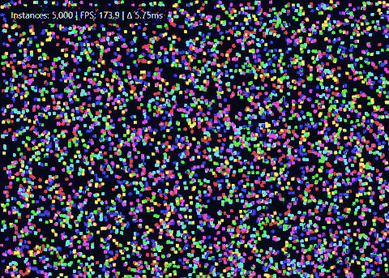

# "Pure-GPU" HTML Renderer, minus the bullsh*t

A Rust-native Chromium runtime for building high-performance, GPU-accelerated desktop applications **without Electron and without system WebViews**.

`rust-cef-runtime` is a low-level Rust runtime built directly on the **Chromium Embedded Framework (CEF)** for developers who need control, performance and consistency beyond OS-managed WebViews.

<p align="center">
  <br>
  <b>Chromium goodness. Native Rust. No WebView. No Electron.</b>
</p>

## Motivation

This project started as a "_GPU-accelerated FPS toy demo built with Tauri for the boys_" that performed extremely well on **Windows (WebView2)** out-of-the-box but encountered hard limitations on **Linux**:

* Compositor vsync limits i.e. VSync-locked rendering on WebKitGTK / WKWebView (~60 FPS)
* Inconsistent GPU paths across OSes
* Limited control over rendering lifecycle

Those constraints are inherent to _system WebViews_. So we pivoted to **CEF**. Chromium gives you the native GPU pipeline but most integrations come with baggage:

* **Electron** bundles Node.js, adds runtime overhead and constrains architecture
* **Custom Chromium builds** are complex, fragile and expensive to maintain

This project takes a different approach:

* Native, reliable Chromium GPU pipeline especially on Linux (and macOS)
* Explicit lifecycle and process control
* No embedded Node.js runtime
* Total control over process boundaries and IPC

## What this project optimizes for

This runtime is well-suited for:

* High-frequency rendering (WebGL/Canvas/WASM-heavy visualization workloads)
* Developers who want **Chromium without Electron**
* Cases where rendering behavior across platforms matters more than convenience
* Building custom shells, engines or non-standard desktop applications

> Anyone who likes Tauri's philosophy but prefers Chromium instead of WebViews.

When you should *not* use this project:

* You want the smallest binary: **use Tauri**
* You want Node.js APIs: **use Electron**
* You're building a standard CRUD UI: use **Tauri or Electron**

This project is not a replacement for Tauri or Electron.

## Setup

### 1. Install CEF (one time)

The runtime automatically downloads the compatible Chromium build required by the Rust bindings.

From the project root:

```bash
cargo run -p rust-cef-installer
```

## Running the examples

After installation you can simply run the demo:

### Default GPU demo (recommended)

```bash
cargo run --example demo
```

Launches a native window rendering a **canvas-based animation** designed to accurately reflect GPU-backed rendering performance.

This is the **primary demo** for evaluating rendering behavior and performance.

> **Rendering note**
>
> Unlike Chrome or Electron, this runtime does not ship with a browser helper process model. Some GPU features may behave differently depending on platform and driver configuration. These differences are architectural and not regressions in rendering performance.

### DOM-based educational demos

These examples illustrate **DOM animation limits** and are **not performance benchmarks**.

```bash
cargo run --example dom
```

Learn from them:

* How main-thread vs compositor behavior affects rendering
* CPU costs of DOM-heavy animations
* Why WebGL / Canvas2D are preferred for high-frequency rendering

## Production packaging

`rust-cef-runtime` does not impose a packaging format.

In production, the embedding application is responsible for bundling frontend assets and selecting the startup URL.

You can run:

```bash
cargo build --example package
```

> Note: Place your built frontend in an `content/` directory next to the executable.

## 🚧 Current status

Early days! Architecture and APIs may change as the project evolves.

#### Implemented

- [x] Cross-platform Rust-native CEF runtime
- [x] Modular runtime architecture
- [x] Native window creation and lifecycle management
- [x] GPU-accelerated rendering via Chromium
- [x] File-based and dev-server frontend loading
- [x] Linux and Windows support
- [x] Examples gallery (Canvas, WebGL/2, WASM, DOM, IPC)
- [x] Custom app protocol
- [x] Structured IPC
- [x] Higher-level application API
- [x] Packaging & distribution helpers

#### In progress / planned

* macOS support
* More packaging helpers
* CI builds and example verification
* Nominal project scaffolding / starter layout

## Philosophy

This project is a streamlined CEF runtime giving direct access to the browser model.

You keep control of:

* Window and browser lifecycle
* Multi-process boundaries
* Renderer <-> native communication

More control. Fewer assumptions.
